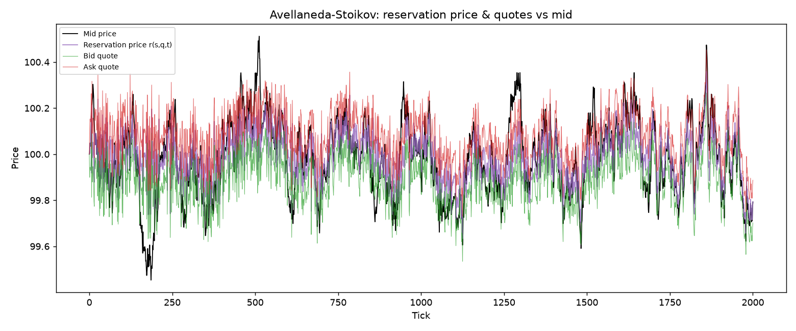
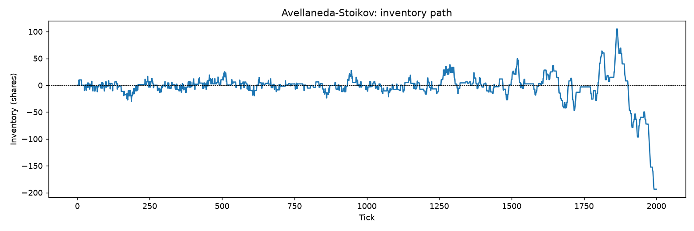
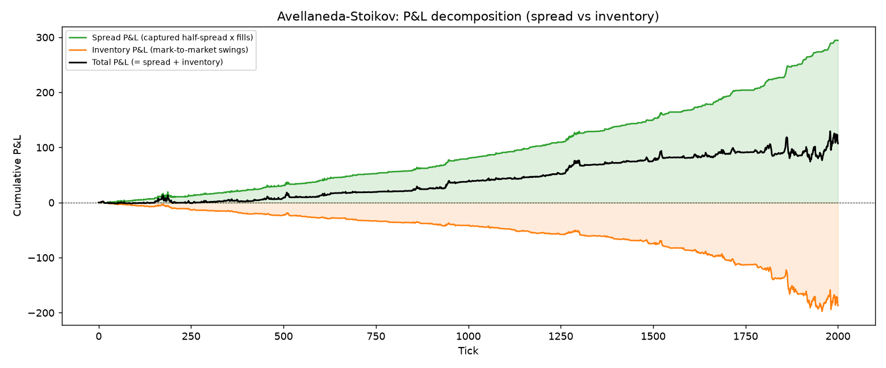
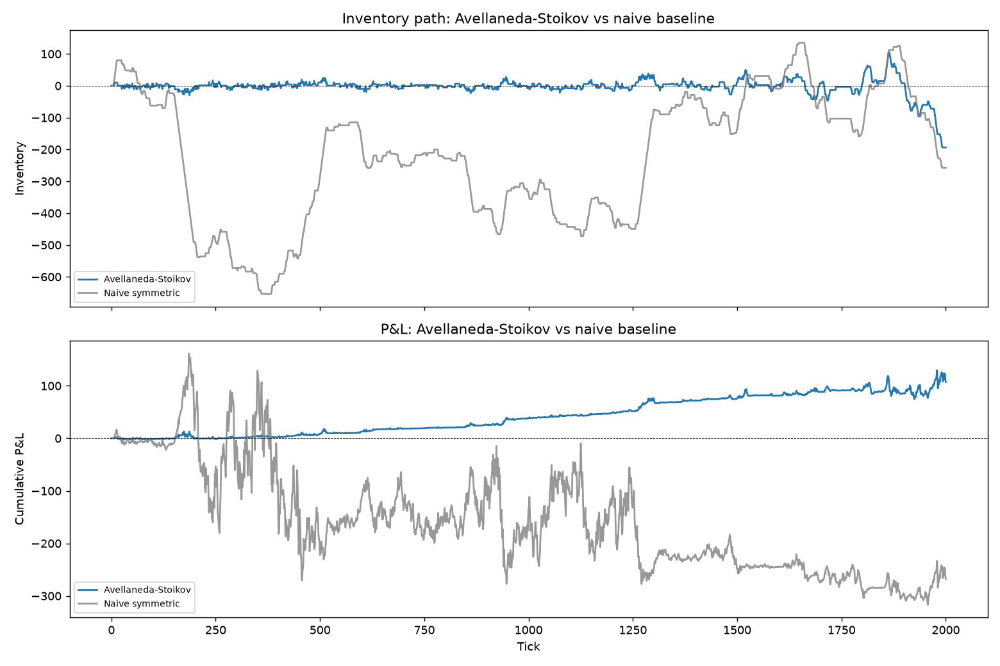
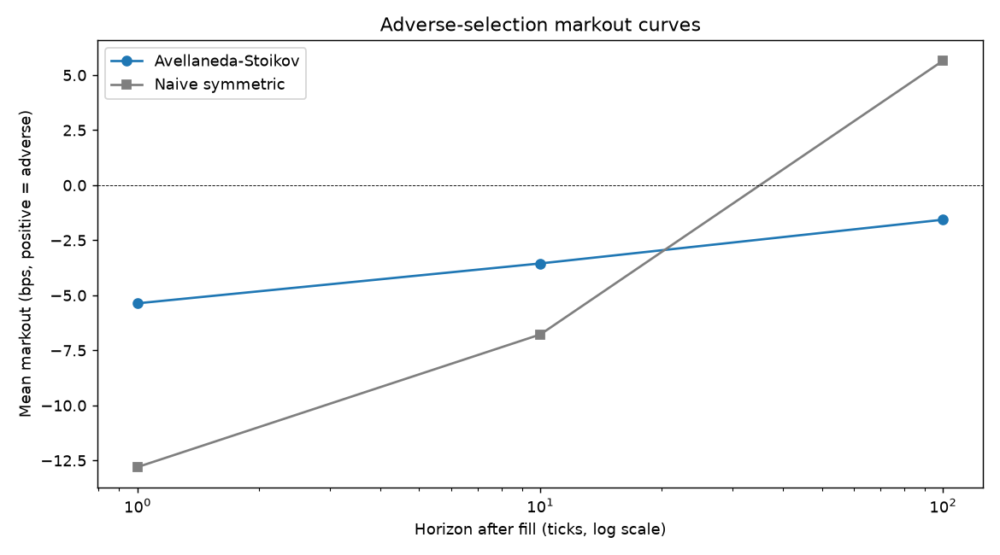
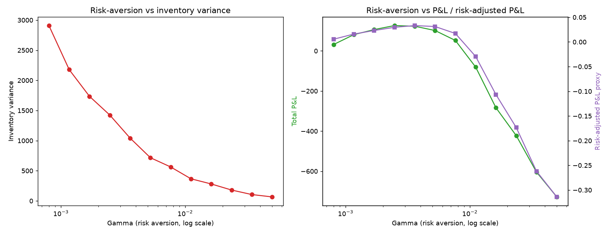

# Avellaneda-Stoikov Market Making Engine

Optimal market-making model (Avellaneda & Stoikov, 2008), implemented
from the HJB equation up, and run as a live strategy against the
project's own limit-order-book simulator ([`dantezerega/orderbook`](https://github.com/dantezerega/orderbook),
vendored under `lob_sim/` unmodified). Compares the closed-form
Avellaneda-Stoikov (AS) quoting policy against a naive fixed-spread,
no-inventory-skew baseline, on inventory risk, P&L decomposition, and
adverse-selection markout.



```
avellaneda-stoikov-mm/
├── lob_sim/            # vendored LOB simulator (orderbook, orders, metrics, simulation) — untouched matching engine
├── as_model/
│   ├── model.py         # closed-form reservation price + optimal spread (the two formulas), fully derived in comments
│   ├── calibration.py   # sigma, k, A estimated from the sim's own price/trade process (not guessed)
│   ├── engine.py         # tick-by-tick MM quoting loop against the LOB sim's OrderBook
│   ├── analytics.py     # markout (adverse selection) + inventory-risk / P&L decomposition metrics
│   ├── sweep.py         # gamma sensitivity sweep
│   └── plots.py         # all charts
├── main.py              # end-to-end runner: calibrate -> run AS -> run naive -> metrics -> sweep -> plots
├── web/                 # interactive Next.js/TypeScript port — deployable to Vercel, see web/README.md
└── output/              # generated PNGs
```

## Run it

```bash
python3 -m venv venv && source venv/bin/activate
pip install -r requirements.txt
python main.py
```

Prints a full text report (calibration, both sessions' metrics, gamma
sweep table) and writes six PNGs to `output/`.

## Interactive web version

`web/` is a full TypeScript port of the model + LOB simulator (parameter
sliders, live charts, head-to-head metrics), deployable to Vercel with
zero backend/database setup — see `web/README.md`.

---

## 1. Derivation: HJB equation to closed-form quotes

### Setup

- Mid price follows arithmetic Brownian motion: `dS_t = sigma dW_t`.
  **Constant volatility is a simplifying assumption** — see Limitations.
- The maker controls how far from the mid to place her bid and ask,
  `delta_b` and `delta_a`. Fill arrivals for each side are modeled as
  Poisson processes with intensity that decays exponentially in the
  quoted distance:
  ```
  lambda(delta) = A * exp(-k * delta)
  ```
  `A` is the arrival-rate scale (how much flow shows up at zero
  distance from the mid); `k` is the decay rate (how fast that flow
  dies off as you quote further away — a proxy for how "thick" the
  book / how price-sensitive the counterparties are).
- The maker has CARA utility over terminal wealth, `u(x) = -exp(-gamma x)`,
  `gamma` = risk aversion.
- State: cash `x_t`, inventory `q_t`, mid `s_t`. Terminal wealth at
  horizon `T` (mark inventory to the terminal mid): `X_T = x_T + q_T s_T`.

### The HJB equation

Let `V(s,x,q,t) = max E[-exp(-gamma X_T) | s_t=s, x_t=x, q_t=q]`. Applying
the dynamic programming principle over an infinitesimal time step, with
Ito's lemma handling the diffusive `s` term and each fill process
contributing a jump term, gives:

```
V_t + (1/2) sigma^2 V_ss
   + max_{delta_b} { lambda(delta_b) [V(s, x-s+delta_b, q+1, t) - V(s,x,q,t)] }
   + max_{delta_a} { lambda(delta_a) [V(s, x+s+delta_a, q-1, t) - V(s,x,q,t)] }
   = 0
V(s,x,q,T) = -exp(-gamma(x+qs))
```

Read the jump terms literally: if the bid gets hit, cash falls by
`s - delta_b` (you bought at `s - delta_b`) and inventory rises by 1;
symmetric logic for the ask.

### Ansatz and reduction to ODEs

Guess the CARA-preserving separable form:

```
V(s,x,q,t) = -exp(-gamma x) exp(-gamma q s) exp(-gamma theta(q,t))
```

Substituting into the HJB equation and dividing out the common
exponential factor collapses the PDE into a system of coupled ODEs for
`theta(q,t)`, one per inventory level. A second-order Taylor expansion
of `theta(q,t)` in `q` around `q=0` — valid as long as a well-run book
keeps `|q|` in a modest range — decouples the system and yields, to
leading order:

```
theta(q,t) = -0.5 * (T-t) * sigma^2 * q^2
```

### Reservation price

Plugging `theta(q,t)` back into the definition of the reservation
(indifference) price — the price at which the maker is indifferent
between holding `q` and `q ± 1` shares given the time left — gives:

```
r(s,q,t) = s - q * gamma * sigma^2 * (T - t)
```

**Physical reading**: if you're long (`q>0`), your indifference price
sits *below* the mid — you'd rather sell than accumulate more risk —
and vice versa if short. The shift scales with how much you're
carrying (`q`), how risk-averse you are (`gamma`), how volatile the
asset is (`sigma^2`), and how much time is left for that inventory to
hurt you (`T-t`). As `t -> T` the shift vanishes: no time left for an
adverse move to matter before you mark to market and stop.

### Optimal spread

Taking first-order conditions on the two per-side maximizations in the
HJB equation (using `lambda(delta) = A e^{-k delta}` and the same `q~0`
expansion) gives the total (bid+ask) optimal spread around the
reservation price:

```
delta = gamma * sigma^2 * (T-t)  +  (2/gamma) * ln(1 + gamma/k)
```

Two distinct terms:
- `gamma * sigma^2 * (T-t)` — **the inventory-risk premium**, identical
  in form to the reservation-price shift; widens the total spread to
  compensate for holding risk over the remaining horizon.
- `(2/gamma) ln(1 + gamma/k)` — **the pure microstructure spread**, the
  monopolistic spread you'd charge even with zero risk-aversion
  pressure from inventory. Depends only on `gamma` and `k`. As
  `gamma -> 0` this term tends to `2/k` (L'Hopital), matching the
  risk-neutral optimal spread; as `k` grows (a thick, liquid book where
  quoting slightly wider kills your fill rate fast) this term shrinks.

Quotes are placed symmetrically around the reservation price:
```
bid = r(s,q,t) - delta/2
ask = r(s,q,t) + delta/2
```

Note the inventory skew appears **twice** relative to the raw mid:
once via the reservation-price shift, and again because `delta` itself
grows with the same `gamma*sigma^2*(T-t)` term. Both effects push a
long maker toward a tighter/more-aggressive ask and a wider/more-passive
bid — the mean-reversion pressure this project set out to build.

**References**: Avellaneda, M. & Stoikov, S. (2008), "High-frequency
trading in a limit order book," *Quantitative Finance* 8(3), 217-224.
Gueant, Lehalle, Fernandez-Tapia (2013) for the exact (non-asymptotic)
solution this asymptotic form approximates.

---

## 2. Parameters — what each one physically means

| Param | Meaning | Effect of increasing it |
|---|---|---|
| `gamma` (risk aversion) | How much the maker penalizes holding inventory risk | Higher gamma -> more inventory skew, tighter inventory variance, wider quoted spread, more conservative (fewer, better-priced fills) |
| `sigma` (volatility) | Instantaneous vol of the mid-price process | Higher sigma -> larger reservation-price shifts and wider spreads for the same inventory (holding risk is scarier when the asset is noisier) |
| `k` (arrival intensity decay) | How fast fill probability drops as you quote further from the mid — proxy for book "thickness"/counterparty price-sensitivity | Higher k -> a thinner effective spread is optimal (quoting wide kills your fills fast, so don't bother) |
| `A` (arrival rate scale) | Baseline order-flow intensity at zero distance from mid | Higher A -> more background liquidity/flow; doesn't enter the closed-form spread directly here (only through calibration/diagnostics), but governs how many fills you actually get per session |
| `T-t` (time remaining) | Time left in the trading session/horizon | As it shrinks to 0, both the reservation-price shift and the inventory-risk spread term vanish — no time left for the position to hurt you |

All four (`gamma`, `sigma`, `k`, `A`) are exposed as `EngineParams`
fields in `as_model/engine.py` — none are hardcoded into the formulas
in `as_model/model.py`.

**Sigma is estimated, not guessed** (`as_model/calibration.py`,
`estimate_sigma`): run the vendored LOB simulator with no market maker
present, take its own OU mid-price path, and compute
`sigma = std(price increments) / sqrt(dt)` under the model's assumed
`dS = sigma dW`.

**k and A are calibrated from the simulator's own trade tape**
(`calibrate_k_A`): run the same background (no-MM) session, record
`|trade_price - contemporaneous fundamental price|` for every trade
that occurs, bin those distances, convert counts to intensities
(trades per unit time per bin), and fit `ln(lambda) = ln(A) - k*delta`
by OLS. This directly estimates the exponential decay assumption the
model itself imposes, from the simulator's actual order-flow process
— not an assumed number. `main.py` prints the fit R² alongside the
calibrated values (R²≈0.94 in the seeded run shipped here).

---

## 3. Results (seeded run, `python main.py`)

Calibrated from a 3,000-tick background run: `sigma≈0.0503`,
`k≈10.79`, `A≈0.75`. AS session run at `gamma=0.005` (near the peak of
the risk-adjusted-P&L sweep, see §5), naive baseline's fixed half-spread
set equal to the AS session's own time-average half-spread (`≈0.099`)
so the comparison isolates the *inventory-skew* effect rather than
differing spread width, over 2,000 ticks:

| Metric | Avellaneda-Stoikov | Naive symmetric |
|---|---:|---:|
| Inventory variance | 735.5 | 40,535.0 |
| Max \|inventory\| | 193.7 | 654.2 |
| Total P&L | **+107.4** | -267.7 |
| P&L volatility (per tick) | 1.64 | 14.79 |
| Spread P&L | 294.5 | 802.6 |
| Inventory P&L | -187.2 | -1,070.3 |
| Risk-adjusted P&L proxy (mean/std of P&L increments) | **+0.033** | -0.009 |
| Markout @ 1 tick (bps, +=adverse) | -5.4 | -12.8 |
| Markout @ 10 ticks | -3.6 | -6.8 |
| Markout @ 100 ticks | -1.6 | +5.7 |





**AS reduces inventory variance by ~98%** relative to the naive
baseline at matched spread width, and turns a negative-P&L session
into a positive one, at better risk-adjusted terms. The naive baseline
captures more raw spread P&L (802.6 vs 294.5 — it quotes far more
often since it never backs off when loaded with inventory) but gives
almost all of it back, and then some, to adverse inventory
mark-to-market swings (-1,070.3 vs -187.2). This is the whole point of
the model: spread capture alone isn't the strategy — what you *do*
with the spread capture once you're carrying risk is.

See `output/04_naive_vs_as.png` for the head-to-head inventory and P&L
paths.



---

## 4. Adverse selection (markout)

For every fill, `as_model/analytics.compute_markouts` measures how the
fundamental price moved over the next N ticks, signed so **positive =
adverse** (you got picked off) and **negative = favorable** (pure
spread capture, no informed-flow cost):
- Buy fill: `markout_bps = (fill_price - mid_{t+N}) / fill_price * 1e4`
- Sell fill: `markout_bps = (mid_{t+N} - fill_price) / fill_price * 1e4`

Reported at 1-, 10-, and 100-tick horizons (`output/06_markout_curves.png`).
In the seeded run both strategies show negative (favorable) markout at
short horizons, but the naive baseline's markout trends toward
*positive* (adverse) at the 100-tick horizon while AS stays negative —
consistent with AS's inventory skew helping it mean-revert away from
positions before adverse flow catches up, where the naive strategy
just holds and gets run over.



---

## 5. Gamma sensitivity — the risk/return dial

`as_model/sweep.py` reruns the AS engine at 12 gamma values (all else
held fixed) and records inventory variance and total/risk-adjusted P&L
at each. `output/05_gamma_sweep.png`:

- **Inventory variance decreases monotonically** in gamma (more risk
  aversion -> tighter inventory control), from ~2,900 at `gamma=0.0008`
  down to ~66 at `gamma=0.05`.
- **P&L and risk-adjusted P&L are hump-shaped**, peaking around
  `gamma≈0.0025-0.0052`: too little risk aversion (`gamma` near 0) lets
  inventory run and eats P&L to adverse moves; too much risk aversion
  quotes so defensively that fill rate/spread capture collapses and
  P&L turns sharply negative (own quotes get too wide/skewed to
  capture meaningful flow).

This is the chart that shows gamma isn't a "plug in a number and
forget it" parameter — it's a genuine dial trading off inventory risk
against P&L, with an interior optimum set by the specific vol/flow
regime you calibrated against.



---

## 6. Limitations of the base model (as implemented)

- **Constant volatility.** The reservation price and spread both use a
  single `sigma`, estimated once from a background run. Real markets
  have time-varying (and regime-dependent) vol; a mis-specified sigma
  directly mis-prices the inventory-risk premium.
- **No adverse-selection modeling in the base HJB.** The classic AS
  model treats fills as exogenous Poisson events with intensity that
  depends only on quoted distance — it does not distinguish informed
  from uninformed flow, and doesn't let the fill intensity depend on
  anything about *why* someone is trading. The markout analysis here
  is a **post-hoc diagnostic** bolted on to check whether that
  assumption is costing you in this particular simulated flow regime —
  it is not fed back into the quoting decision itself.
- **No jump risk.** The underlying is pure diffusion; large discrete
  moves (news, flow shocks) are not represented, so the model
  systematically underprices tail inventory risk.
- **Linear/exponential fill-intensity form is an approximation.** The
  `A*exp(-k*delta)` form is a common, tractable choice, not derived
  from first principles about this simulator's flow — it's fit
  empirically here (§2) rather than assumed with made-up numbers, but
  it's still a modeling choice, not a law.
- **Symmetric quoting around a single reservation price** ignores
  queue position, order size effects on fill probability, and any
  correlation between the maker's own quotes and the arriving flow's
  behavior (e.g., flow that reacts to visible depth).
- **No latency / no queue priority.** Quotes are assumed to land and
  rest instantly with FIFO priority as modeled by the vendored LOB sim;
  no modeling of race conditions, cancel-replace latency, or
  competing market makers' response to the same fill signals.

## 7. What it would take to make this desk-grade

- **Proper queue-position modeling**: track where in the FIFO queue at
  each price level your resting order sits, and make fill probability
  a function of queue position, not just distance from mid.
- **Calibrated fill-probability model from real data**: replace the
  assumed exponential-intensity form with a model fit to your venue's
  actual historical fill/cancel/queue data (potentially non-exponential,
  size-dependent, time-of-day dependent).
- **Stochastic/regime-switching volatility** in the HJB itself (e.g., a
  Heston-style vol process), which breaks the clean closed-form
  solution and requires numerical HJB solving (finite differences or
  the Gueant et al. approach) rather than the closed-form approximation
  used here.
- **True adverse-selection-aware quoting**: condition quote skew not
  just on inventory but on short-term order-flow toxicity signals
  (e.g., VPIN-style flow toxicity, order-book imbalance, or realized
  short-horizon markout itself), rather than treating adverse selection
  as a metric to check after the fact.
- **Latency and queue-priority-aware order management**: model the
  actual cancel-replace round trip, and the risk of being at the back
  of the queue after a requote versus staying resting and accepting a
  stale quote for a few more milliseconds.
- **Multi-asset / correlated inventory risk**: the single-asset HJB
  here doesn't generalize automatically to a portfolio of correlated
  instruments (e.g., quoting related credit or equity names
  simultaneously) — that requires a vector-valued inventory state and
  a covariance-aware risk penalty.
